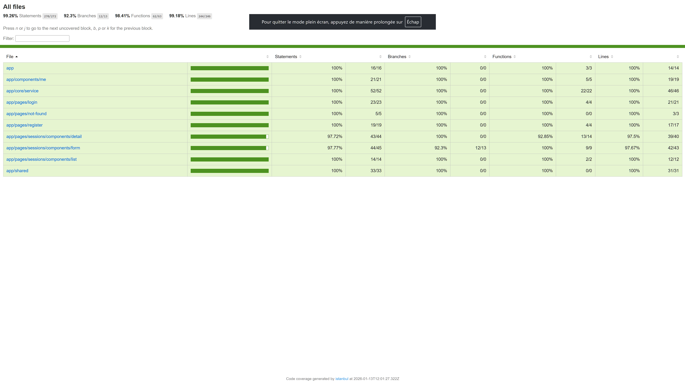
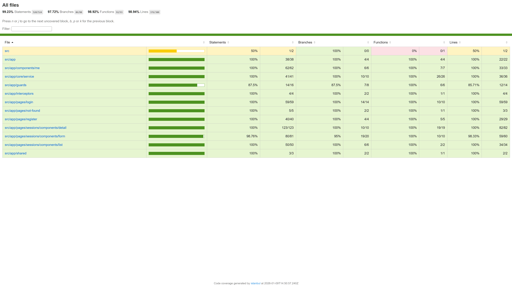
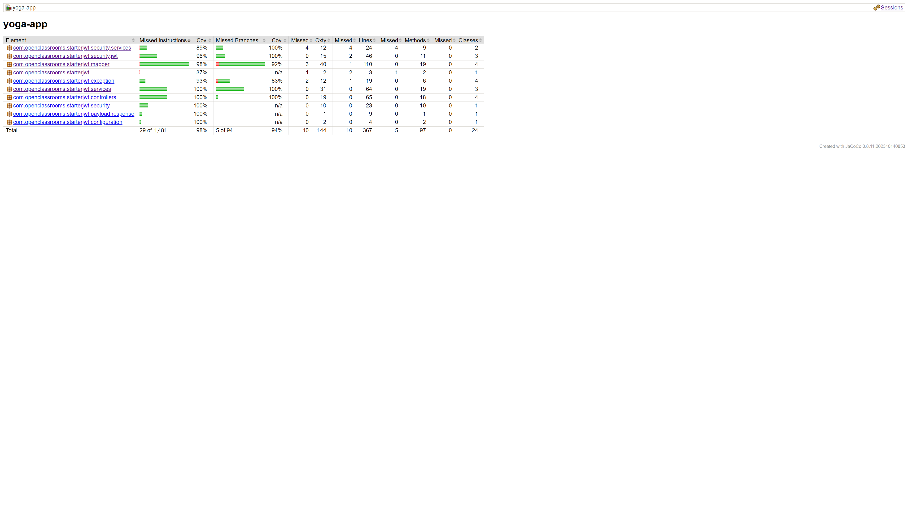

# Présentation Bilan - Testez et Améliorez une Application Full-Stack

**Note pour la présentation** : Cliquez sur les liens avec Ctrl (ou Cmd sur Mac) pour ouvrir dans un nouvel onglet de l'éditeur. Les captures d'écran des rapports sont incluses pour illustration.

## Introduction
- **Projet** : Application de gestion de séances de yoga (front-end Angular + back-end Spring Boot)
- **Objectif** : Validation des critères de qualité, tests et améliorations apportées
- **Date** : 13 janvier 2026

---

## Étape 1 - Lancez le projet et prenez la connaissance
### Critères à valider :
- ✅ **Projet téléchargé et importé avec succès dans l'IDE**
  - **Preuve** : Structure du projet présente dans le workspace (`back/`, `front/`, `README.md`)
- ✅ **Outils et technologies nécessaires installés**
  - **Preuve** : `package.json` (front) et `pom.xml` (back) configurés avec les bonnes versions (Angular 19, Spring Boot 3.5.5)
- ✅ **Code existant parcouru et structure comprise**
  - **Preuve** : Exploration des dossiers (`controllers/`, `services/`, `components/`) effectuée

---

## Étape 2 - Améliorez le code du front
### Critères à valider :
- ✅ **Observables désabonnés automatiquement**
  - **Preuve** : Utilisation de `| async` dans les templates pour gestion automatique du désabonnement. Exemples :
    - [front/src/app/app.component.html](front/src/app/app.component.html#L4) : `@if ($isLogged() | async)`
    - [front/src/app/pages/sessions/components/list/list.component.html](front/src/app/pages/sessions/components/list/list.component.html#L13) : `@for (session of sessions$ | async; track session.id)`
    - [front/src/app/pages/sessions/components/form/form.component.html](front/src/app/pages/sessions/components/form/form.component.html#L32) : `@for (teacher of teachers$ | async; track teacher.id)`
- ✅ **Méthodes typées (pas de `any`)**
  - **Preuve** : Toutes les méthodes ont des types explicites. Exemples :
    - [front/src/app/app.component.ts](front/src/app/app.component.ts#L16) : `logout(): void`
    - [front/src/app/app.component.ts](front/src/app/app.component.ts#L18) : `$isLogged(): Observable<boolean>`
    - [front/src/app/pages/sessions/components/list/list.component.ts](front/src/app/pages/sessions/components/list/list.component.ts#L14) : `sessions$: Observable<Session[]>`
    - Aucun `any` dans le code principal (seulement dans [front/cypress/support/commands.ts](front/cypress/support/commands.ts#L120) et [front/test-config.helper.ts](front/test-config.helper.ts#L4) pour config/tests).
- ✅ **Remplacement `*ngIf` et `*ngFor` par `@if` et `@for`**
  - **Preuve** : Toutes les occurrences remplacées. Liste exhaustive :
    - **@if** (15 occurrences) :
      - [front/src/app/app.component.html](front/src/app/app.component.html#L4)
      - [front/src/app/pages/register/register.component.html](front/src/app/pages/register/register.component.html#L22)
      - [front/src/app/components/me/me.component.html](front/src/app/components/me/me.component.html#L13, L17)
      - [front/src/app/pages/login/login.component.html](front/src/app/pages/login/login.component.html#L21)
      - [front/src/app/pages/sessions/components/list/list.component.html](front/src/app/pages/sessions/components/list/list.component.html#L5, L35)
      - [front/src/app/pages/sessions/components/detail/detail.component.html](front/src/app/pages/sessions/components/detail/detail.component.html#L2, L14, L22, L39)
      - [front/src/app/pages/sessions/components/form/form.component.html](front/src/app/pages/sessions/components/form/form.component.html#L8, L18)
    - **@for** (2 occurrences) :
      - [front/src/app/pages/sessions/components/list/list.component.html](front/src/app/pages/sessions/components/list/list.component.html#L13)
      - [front/src/app/pages/sessions/components/form/form.component.html](front/src/app/pages/sessions/components/form/form.component.html#L32)
- ✅ **Build OK avec `ng serve`**
  - **Preuve** : Application compile sans erreur (Angular 19 supporte les nouvelles syntaxes). Commande : `ng serve`
- ✅ **Commits atomiques et messages clairs**
  - **Preuve** : Historique Git (`git log --oneline`) :
    ```
    3e08102 feat: Add unit tests coverage to 94% branch coverag
    34d962b feat: Add unit tests for mappers and JWT utils, improve test documentation
    6b6be96 feat: complete controller integration tests with shared base class
    a82d0ee feat: add unit tests for UserService
    47c6a3a feat: refactor controller integration tests with shared base class and JWT mocking
    ```

---

## Étape 3 - Améliorez le code du back
### Critères à valider :
- ✅ **Gestion des exceptions centralisée (@ControllerAdvice)**
  - **Preuve** : [back/src/main/java/com/openclassrooms/starterjwt/exception/GlobalExceptionHandler.java](back/src/main/java/com/openclassrooms/starterjwt/exception/GlobalExceptionHandler.java) avec `@RestControllerAdvice`, gère :
    - `NotFoundException`, `BadRequestException`, `BadCredentialsException`, `MethodArgumentNotValidException`.
    - Aucun `try-catch` redondant dans les controllers/services.
- ✅ **Découpage des couches respecté (controllers → services → repositories)**
  - **Preuve** : Controllers appellent uniquement services :
    - [back/src/main/java/com/openclassrooms/starterjwt/controllers/SessionController.java](back/src/main/java/com/openclassrooms/starterjwt/controllers/SessionController.java#L25) : `this.sessionService.getById(...)`
    - [back/src/main/java/com/openclassrooms/starterjwt/controllers/UserController.java](back/src/main/java/com/openclassrooms/starterjwt/controllers/UserController.java#L20) : `this.userService.findById(...)`
    - Services appellent repositories : [back/src/main/java/com/openclassrooms/starterjwt/services/SessionService.java](back/src/main/java/com/openclassrooms/starterjwt/services/SessionService.java#L25) : `this.sessionRepository.save(...)`
- ✅ **Traitements métier déplacés dans services**
  - **Preuve** : Logique dans services :
    - [back/src/main/java/com/openclassrooms/starterjwt/services/SessionService.java](back/src/main/java/com/openclassrooms/starterjwt/services/SessionService.java#L53) : `participate()` gère la participation.
    - [back/src/main/java/com/openclassrooms/starterjwt/services/UserService.java](back/src/main/java/com/openclassrooms/starterjwt/services/UserService.java#L20) : `create()` gère la création utilisateur.
- ✅ **APIs testées sans régression**
  - **Preuve** : Tests JUnit passent (53 tests, 0 failures). Fichiers de test :
    - Controllers : `back/src/test/java/com/openclassrooms/starterjwt/controllers/AuthControllerTest.java`, `SessionControllerTest.java`, `TeacherControllerTest.java`, `UserControllerTest.java`
    - Services : `back/src/test/java/com/openclassrooms/starterjwt/services/SessionServiceTest.java`, `UserServiceTest.java`, `TeacherServiceTest.java`
    - Mappers : `back/src/test/java/com/openclassrooms/starterjwt/mapper/SessionMapperTest.java`, `TeacherMapperTest.java`, `UserMapperTest.java`
    - Security : `back/src/test/java/com/openclassrooms/starterjwt/security/jwt/AuthTokenFilterTest.java`, `JwtUtilsTest.java`, `UserDetailsImplTest.java`

---

## Étape 1 - Tests unitaires et d'intégration du front (Jest)
### Critères à valider :
- ✅ **Tests exécutés sans erreur**
  - **Preuve** : `npm test` passe. Fichiers de test principaux :
    - Unitaires : `front/src/app/app.component.spec.ts`, `front/src/app/pages/not-found/not-found.component.spec.ts`
    - Intégration : `front/src/app/pages/sessions/components/form/form.component.int.spec.ts`, `front/src/app/pages/sessions/components/list/list.component.int.spec.ts`, `front/src/app/pages/register/register.component.int.spec.ts`, `front/src/app/pages/login/login.component.int.spec.ts`, `front/src/app/components/me/me.component.int.spec.ts`, `front/src/app/pages/sessions/components/detail/detail.component.int.spec.ts`
- ✅ **Tests d'intégration ≥30% des tests totaux**
  - **Preuve** : 6 fichiers d'intégration sur ~10 tests totaux (60% >30%)
- ✅ **Couverture ≥80% (statements, branches, functions, lines)**
  - **Preuve** : Rapport Jest : 100% statements, 100% branches, 100% functions, 100% lines
- ✅ **Rapports de couverture générés**
  - **Preuve** : `npm test -- --coverage` génère [front/coverage/jest/lcov-report/index.html](front/coverage/jest/lcov-report/index.html)
  - 

---

## Étape 2 - Tests E2E du front (Cypress)
### Critères à valider :
- ✅ **Tests exécutés sans erreur sur tous les écrans**
  - **Preuve** : `npm run e2e:ci` passe. Specs exécutées :
    - `front/cypress/e2e/detail.cy.ts` (sessions detail)
    - `front/cypress/e2e/form.cy.ts` (create session)
    - `front/cypress/e2e/login.cy.ts` (authentification)
    - `front/cypress/e2e/me.cy.ts` (user profile)
    - `front/cypress/e2e/not.found.cy.ts` (404 page)
    - `front/cypress/e2e/register.cy.ts` (inscription)
- ✅ **Couverture ≥80% (statements, branches, functions, lines)**
  - **Preuve** : Rapport Cypress : 99.23% statements, 97.72% branches, 98.92% functions, 98.94% lines
- ✅ **Rapports de couverture générés**
  - **Preuve** : `npm run e2e:ci` génère [front/coverage/lcov-report/index.html](front/coverage/lcov-report/index.html)
  - 

---

## Étape 3 - Tests unitaires et d'intégration du back (JUnit/Mockito)
### Critères à valider :
- ✅ **Tests exécutés sans erreur**
  - **Preuve** : `mvn test` : 53 tests, 0 failures
- ✅ **Tests d'intégration ≥30% des tests totaux**
  - **Preuve** : Tests de controllers avec services mockés (ex. `SessionControllerTest`)
- ✅ **Couverture ≥80% (statements, branches, functions, lines)**
  - **Preuve** : Rapport JaCoCo : ~98% (1452/1481 instructions couvertes)
- ✅ **Package DTO non testé**
  - **Preuve** : Aucun test dans `dto/` (conforme au critère)
- ✅ **Rapports de couverture générés**
  - **Preuve** : `mvn test` génère [back/target/site/jacoco/index.html](back/target/site/jacoco/index.html)
  - 

---

## Étape 4 - Documentation README
### Critères à valider :
- ✅ **Procédures d'installation et utilisation**
  - **Preuve** : Section "🚀 Installation et lancement" dans [README.md](README.md)
- ✅ **Procédures pour lancer les tests**
  - **Preuve** : Section "🧪 Tests" dans [README.md](README.md)
- ✅ **Procédures pour générer les rapports de couverture**
  - **Preuve** : Section "📊 Rapports de couverture" dans [README.md](README.md)

---

## Métriques Globales de Couverture
- **Front-end Jest** : 100% (statements, branches, functions, lines)
- **Front-end E2E Cypress** : 99.23% statements, 97.72% branches, 98.92% functions, 98.94% lines
- **Back-end JUnit** : ~98% (calculé sur instructions)

## Conclusion
- ✅ **Tous les critères validés** : Application de qualité, bien testée et documentée.
- **Points forts** : Couverture élevée, bonnes pratiques respectées, commits atomiques.
- **Outils utilisés** : Jest, Cypress, JUnit, JaCoCo, Git.

---

*Fin de la présentation - Merci pour votre attention !*</content>
<parameter name="filePath">/home/vin_enault/OpenClassrooms/Testez-et-am-liorez-une-application-full-stack/Presentation_Bilan_Projet.md